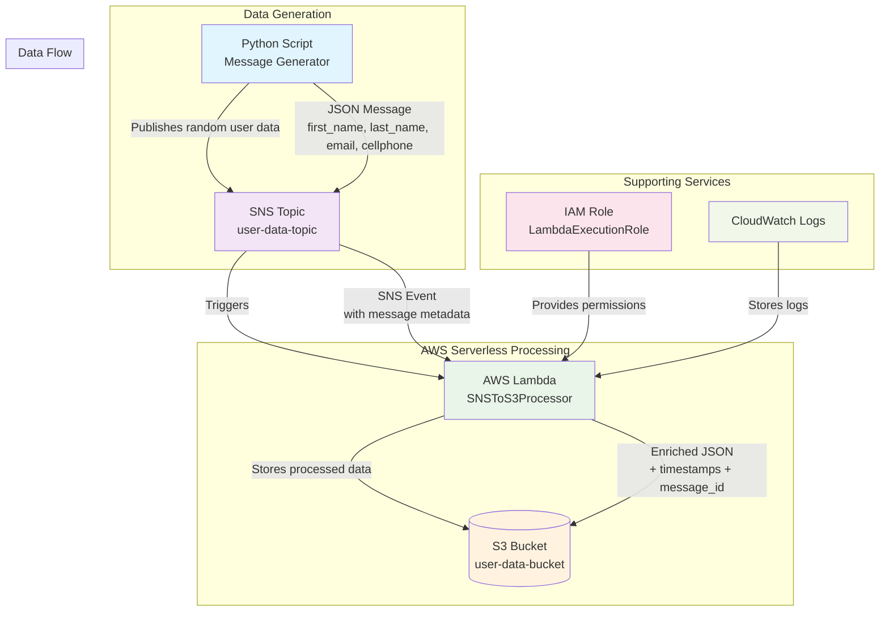

# Amazon Simple Notification Service (SNS)

## Overview

Amazon Simple Notification Service (SNS) is a fully managed messaging service provided by AWS that enables message delivery from publishers to subscribers (also known as producers and consumers). It follows a pub/sub (publish-subscribe) messaging pattern.

## Key Concepts

### Topics

- **Logical access points** for communication
- Publishers send messages to topics
- Subscribers receive messages from topics they're interested in

### Message Formats

- **SMS** (Short Message Service) - text messages to phone numbers
- **Email** (SMTP) - messages to email addresses
- **HTTP/HTTPS** - messages to web endpoints
- **Amazon SQS** - integration with queue service
- **AWS Lambda** - serverless function triggers
- **Mobile Push** - notifications to mobile devices

## Core Features

- **Pub/Sub Messaging**: Decouple and scale microservices, distributed systems, and serverless applications
- **Fanout**: Deliver messages to multiple subscribers simultaneously
- **High Durability**: Messages are stored redundantly across multiple availability zones
- **Security**: Encryption at rest and in transit with fine-grained access control
- **Flexible Delivery**: Multiple protocols and endpoints supported

## Common Use Cases

- **Application Alerts**: System notifications and monitoring alerts
- **Workflow Orchestration**: Coordinate between distributed application components
- **Mobile Notifications**: Push notifications to iOS, Android, and other devices
- **Event-Driven Architectures**: Trigger actions in response to events
- **System-to-System Messaging**: Communication between decoupled services

## Pricing

- Pay-as-you-go model
- Costs based on:
  - Number of messages published
  - Number of notifications delivered
  - Data transfer charges

## Integration

SNS seamlessly integrates with other AWS services including:

- CloudWatch (monitoring)
- Lambda (serverless computing)
- SQS (message queuing)
- Mobile Hub (mobile development)
- Many other AWS services

## Benefits

- **Fully Managed**: No infrastructure to provision or manage
- **Highly Scalable**: Automatically scales with your workload
- **Reliable**: Built on AWS's highly available infrastructure
- **Flexible**: Supports multiple message formats and delivery protocols

## Example

List topics

```bash
aws sns list-topics
```

Create sns topic

```bash
aws sns create-topic --name my-topic \
    --attributes DisplayName="My Production Topic"
```

Create email subscription for a topic

```bash
aws sns subscribe \
    --topic-arn "ARN OF TOPIC" \
    --protocol email \
    --notification-endpoint user@example.com
```

Check subscription status

```bash
aws sns list-subscriptions-by-topic \
    --topic-arn "ARN OF TOPIC"
```

Send message to topic

```bash
aws sns publish \
    --topic-arn "ARN OF TOPIC" \
    --subject "Test Message" \
    --message "Hello from AWS SNS! This is a test message."
```

## Example 2

This use case implements a serverless data processing pipeline where an SNS topic acts as the central messaging hub. The process begins when random user data messages in JSON format (containing first name, last name, email, and cellphone) are published to the SNS topic. This publication automatically triggers a subscribed Lambda function, which processes each incoming message by enriching it with metadata such as timestamps and message IDs. The Lambda function then stores the enhanced data as JSON files in an S3 bucket, organizing them in a folder structure by date for efficient storage and retrieval, creating a fully managed, scalable solution for message processing and archival.



Create sns topic

```bash
aws sns create-topic --name user-data-topic
```

Create the s3 bucket

```bash
aws s3 mb s3://user-data-bucket-$(date +%s)
```

Create the IAM role

```bash
aws iam create-role \
    --role-name LambdaExecutionRole \
    --assume-role-policy-document file://trust-policy.json
```

Attach s3 full access policy

```bash
aws iam attach-role-policy \
    --role-name LambdaExecutionRole \
    --policy-arn arn:aws:iam::aws:policy/AmazonS3FullAccess
```

Attach AWS Lambda execution role

```bash
aws iam attach-role-policy \
    --role-name LambdaExecutionRole \
    --policy-arn arn:aws:iam::aws:policy/service-role/AWSLambdaBasicExecutionRole
```

Get role arn

```bash
aws iam get-role --role-name LambdaExecutionRole --query 'Role.Arn' --output text
```

Create lambda deployment package

```bash
zip lambda-function.zip lambda_function.py
```

Create lambda function

```bash
# Replace with your actual role ARN
aws lambda create-function \
    --function-name SNSToS3Processor \
    --runtime python3.9 \
    --role "ARN OF THE ROLE" \
    --handler lambda_function.lambda_handler \
    --zip-file fileb://lambda-function.zip \
    --timeout 30 \
    --memory-size 128
```

If needed you can update function code

```bash
aws lambda update-function-code \
    --function-name SNSToS3Processor \
    --zip-file fileb://lambda-function.zip
```

Add sns trigger to lambda function and subscribe lambda function to sns

```bash
# Replace with your actual topic ARN and account ID
aws lambda add-permission \
    --function-name SNSToS3Processor \
    --statement-id sns-trigger-permission \
    --action lambda:InvokeFunction \
    --principal sns.amazonaws.com \
    --source-arn "ARN OF TOPIC"

# Subscribe the Lambda function to the SNS topic
aws sns subscribe \
    --topic-arn "ARN OF TOPIC" \
    --protocol lambda \
    --notification-endpoint "ARN TO LAMBDA FUNCTION"
```

Initiate the message_generator.py

```bash
poetry run python message_generator.py
```
