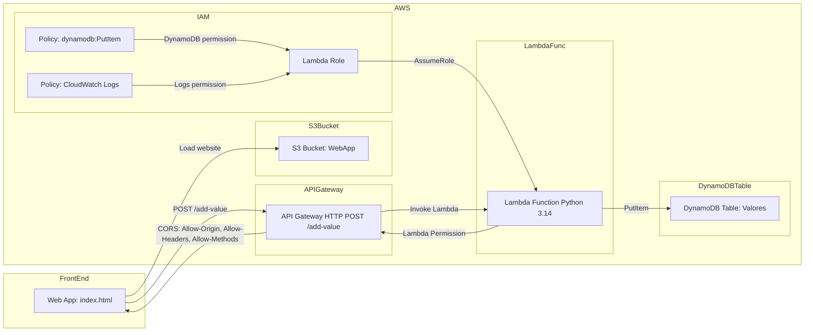

Perfeito! Vamos criar uma **versão completa do README em inglês**, mantendo o passo a passo que fizemos na AWS UI e o diagrama **Mermaid** já corrigido e detalhado.

---

# **AWS Web App Project - README**

## **Architecture**



**Explanation:**

- **Front-End:** `index.html`, served locally or via S3.
- **S3:** Public bucket hosting the static website.
- **API Gateway:** HTTP API with `POST /add-value` route, CORS enabled.
- **Lambda:** Python 3.14, inserts values into DynamoDB.
- **DynamoDB:** Table `Valores` storing `id` and `value`.
- **IAM Role & Policies:** Lambda execution role, DynamoDB write permission, CloudWatch logs permission.
- **CORS:** Allows the front-end to call API Gateway from different origin.

---

## **Step-by-Step Deployment via AWS Console**

### **1️⃣ Create DynamoDB Table**

1. AWS Console → **DynamoDB → Create Table**
2. Table name: `Valores`
3. Partition key: `id` (String)
4. Billing mode: **On-demand**
5. Save

---

### **2️⃣ Create Lambda Function**

1. AWS Console → **Lambda → Create function → Author from scratch**
2. Name: `AddValueFunction`
3. Runtime: Python 3.14
4. Code: use `lambda_function.py`
5. Assign **IAM Role** with `dynamodb:PutItem` permission on the `Valores` table
6. Test Lambda in console with:

```json
{
  "body": "{\"value\":\"Test123\"}"
}
```

---

### **3️⃣ Create API Gateway**

1. AWS Console → **API Gateway → Create API → HTTP API**
2. Integration: **Lambda → AddValueFunction**
3. Route: `POST /add-value`
4. Deploy stage: `prod`
5. Copy the endpoint URL

> ⚠️ Include the route `/add-value` when calling via browser or curl.

---

### **4️⃣ Enable CORS**

1. On the `POST /add-value` route, go to **CORS → Configure**
2. Settings:

   - Allowed origins: `*` (for local testing)
   - Allowed headers: `Content-Type`
   - Allowed methods: `POST`

3. Save and redeploy

---

### **5️⃣ Create a Simple Front-End**

- `index.html` example:

```html
<input type="text" id="value" placeholder="Enter a value" />
<button onclick="addValue()">Add Value</button>
<script>
  const API_URL = "<PASTE_YOUR_API_GATEWAY_URL_HERE>";
  async function addValue() {
    const value = document.getElementById("value").value;
    await fetch(API_URL, {
      method: "POST",
      headers: { "Content-Type": "application/json" },
      body: JSON.stringify({ value }),
    });
    alert("Value sent!");
  }
</script>
```

- Open locally → type a value → click “Add Value”
- If `"Value added successfully!"` appears and DynamoDB has the item, it works.

---

### **6️⃣ Host Front-End on S3**

1. AWS Console → **S3 → Create bucket** (unique name, public)
2. Upload `index.html`
3. Properties → **Static website hosting → Enable → Index document: index.html**
4. Set **bucket policy** for public read:

```json
{
  "Version": "2012-10-17",
  "Statement": [
    {
      "Sid": "PublicReadGetObject",
      "Effect": "Allow",
      "Principal": "*",
      "Action": "s3:GetObject",
      "Resource": "arn:aws:s3:::YOUR_BUCKET_NAME/*"
    }
  ]
}
```

5. Access the bucket URL → front-end online

---

### **7️⃣ Final Flow**

```
[Front-End on S3] → POST /add-value → [Lambda Python] → [DynamoDB]
```

- Test via browser, curl, or API Gateway
- Fully working via AWS UI

---

Se você quiser, posso criar também uma **versão final do README pronta para Terraform ou CDK**, mantendo o mesmo estilo e diagrama em Mermaid, mas com instruções de **IaC deployment**.

Quer que eu faça isso?
